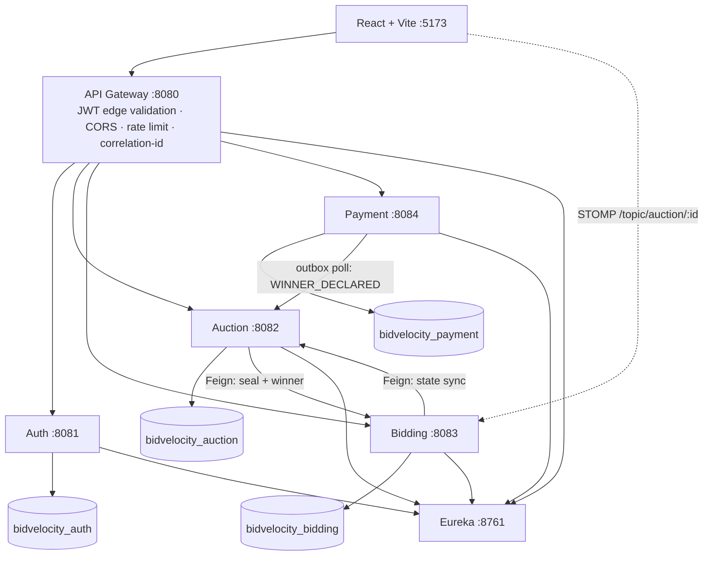

# ⚡ BidVelocity — Real-Time Distributed Bidding & Auction Clearance Engine

> **Where Every Bid Moves in Real Time.** A production-grade, microservices-based auction
> marketplace built as a genuine distributed system — not a CRUD app in a trench coat.

| | |
|---|---|
| **Live demo** | https://bidvelocity.vercel.app |
| **Stack** | Java 21 · Spring Boot 3.5 · Spring Cloud 2025 · React 18 + TypeScript + Vite · PostgreSQL 18 · Flyway |
| **Tests** | 44/44 unit & integration (6 modules) + 2/2 real-PostgreSQL concurrency ITs |
| **Infra** | Native Windows — **no Docker required** |

## The problem this solves

An auction is one of the hardest real-time concurrency problems: hundreds of bidders race
on the same item in the final seconds, and **every bid must be fair, durable, and
non-repudiable**. BidVelocity answers with database-per-service microservices, an
atomic bid-acceptance gate proven under real PostgreSQL contention, deterministic winner
resolution, and event-driven settlement.

## Architecture



**Strict database-per-service:** no cross-service table access, no cross-database FKs —
logical IDs only, everything else is REST or events. Full diagrams:
[`docs/architecture/system.md`](docs/architecture/system.md).

## Capabilities

### Auth Service (`:8081`)
- Registration with bean validation + **BCrypt** password hashing (never plaintext, never logged)
- Login with constant-time credential burn on unknown users (no user-enumeration oracle)
- **JWT access tokens** (userId, email, roles, iat, exp) + **refresh-token rotation** with
  **reuse detection** — a stolen-then-replayed refresh token revokes the entire token family
  (REQUIRES_NEW guard so the revocation survives the failed attempt's rollback)
- Roles `USER · SELLER · ADMIN`; ADMIN can never be self-assigned at registration
- **Google Sign-In** (server-side OAuth2 via Spring Security): find-or-create user, assign
  USER role, mint the app JWT, hand off to React via URL fragment. The client secret lives
  only in the auth-service environment — never in the frontend, never in git
- Suspension cuts live sessions instantly (login blocked + refresh families revoked)
- Flyway-owned schema: `users · roles · user_roles · refresh_tokens`

### Auction Service (`:8082`)
- Full lifecycle **state machine**: `DRAFT → SCHEDULED → LIVE → ENDING → ENDED → SOLD/UNSOLD`,
  invalid transitions rejected with `409 INVALID_STATE_TRANSITION`
- Scheduler: auto-activation at start time, ENDING mode in the final 60 s, deterministic closing
- **Optimistic locking** (`@Version`) on the auction row
- **Transactional outbox**: `WINNER_DECLARED` is written in the *same commit* as the SOLD state
  change — settlement can never desync from the auction record
- Marketplace search: keyword / category / status (incl. `OPEN`) / price range / sort / pagination
- **Real product images** (`imageUrl`, hot-linked from Wikimedia Commons, emoji fallback)

### Bidding Service (`:8083`) — the hot path
- **Atomic acceptance gate**: `SELECT … FOR UPDATE` row lock + `pg_advisory_xact_lock` +
  a compare-and-swap `UPDATE … WHERE` that re-checks status, clock, ladder minimum, price and
  top-bid parity *inside the SQL predicate* — evaluated against committed values at lock time
- **Idempotency**: unique `Idempotency-Key` constraint; replays return the original outcome,
  never a second bid
- **Anti-sniping**: bids inside the configurable window extend the clock, hard-capped
  (`extensionWindowSeconds`, `maxExtensions`), race-free by construction
- **Deterministic winner**: `amount DESC → accepted_at ASC → bid id ASC`; sealing the ledger
  stops all further bids; repeated resolution always returns the same winner
- **Real-time**: WebSocket/STOMP (`/ws`, `/topic/auction/{id}`, `/topic/user/{id}`) —
  bids, extensions and sealing broadcast after commit; outbid notifications per user
- Per-user bid throttling (12/10 s per auction) + gateway rate limiting

### Payment Service (`:8084`)
- Consumes `WINNER_DECLARED` from the auction outbox (at-least-once; idempotent on
  `auction:<id>` unique key) — **never** a synchronous Bidding→Auction→Payment chain
- Payment state machine: `PENDING → PROCESSING → SUCCESS/FAILED → retry → REFUNDED`, `EXPIRED` sweep
- `PaymentProvider` abstraction with `MockPaymentProvider` (reproducible success/failure
  sequence exercising retry paths); Razorpay/Stripe drop in without touching the service
- No raw card data anywhere — provider references only

### API Gateway (`:8080`) & Eureka (`:8761`)
- Single public entry point, `lb://` routes resolved through Eureka
- Edge JWT validation: forged `X-User-*` headers always stripped, verified claims injected
- Anonymous GETs allowed for marketplace browsing; every write requires a valid JWT
- OAuth2 initiation + callback routed to the auth service with correct forwarded headers
- CORS for configured origins, per-route rate limiting (tighter on `/api/bids`, `/api/auth/login`)
- Correlation IDs on every request/response; unified error contract on all services:
  `{timestamp, status, error, message, path, correlationId}`

### Frontend (React + TypeScript + Vite + Tailwind)
Landing (hero, live ticker, featured lots) · Marketplace (search/filter/sort/pagination) ·
**Live auction room** (real-time bids via STOMP with automatic polling fallback, countdown,
ending-mode pulse, bid-confidence panel, anti-snipe counter, bid heatmap, live activity feed) ·
Google + email/password **sign-in & registration** · Dashboard · My bids · Payments (pay/retry) ·
Seller studio (create auction with validation, image URL, manage lots) · Admin console
(users suspend/activate, auctions force-close, payments, service health links) ·
404/500 pages · Inter/system font stack — no vendor/AI fonts · dark fintech theme

## The catalogue (real photography, served in-app)

| Lot | Image source (Wikimedia Commons) |
|---|---|
| Vintage Leica M3 Rangefinder |  |
| Nikon Z9 Mirrorless |  |
| Kashmiri Silk Carpet |  |
| Rolex Submariner |  |
| Yamaha NMAX 155 |  |
| Royal Enfield Himalayan |  |

## Verified end-to-end (executed, not asserted)

- Register → login → JWT → create auction (seller) → bid (buyer) → **reserve enforcement**:
  a ₹32,000 top bid against a ₹42,000 reserve closed as `UNSOLD / RESERVE_NOT_MET`
- SOLD chain: auction ends → `WINNER_DECLARED` outbox → payment-service **auto-created the
  invoice** → winner paid → `SUCCESS` with provider reference
- **24 simultaneous equal bids on real PostgreSQL → exactly 1 accepted** (repeatable);
  **100-bidder ladder strictly increasing**, projection never diverges from the durable ledger
- Deployed Vercel bundle → cloudflared tunnel → gateway → auth: login 200 + correct
  `Access-Control-Allow-Origin` for the vercel.app origin

## Testing

```bat
scripts\build-test.bat        :: all 6 modules, 44 tests (H2 in PostgreSQL mode)
scripts\run-pg-tests.bat      :: real-PostgreSQL concurrency ITs (24-way + 100-way)
```

The PG suite caught a genuine race that H2 could never show (concurrent first-bid hydration
burst) — fixed with the CAS gate + advisory lock + serialized guard, then re-proven green.
JWT tamper/expiry, BCrypt-only storage, state-machine 409s, idempotent replay, anti-snipe
caps, deterministic resolution, outbox→invoice idempotency and payment retries are all
covered by named tests.

## Running locally (no Docker)

```bat
:: 0. prerequisites: Temurin JDK 21, Maven 3.9, Node 18+, PostgreSQL running on :5432
copy .env.example .env         :: then edit .env — set DB_PASSWORD locally, never share it
scripts\setup-databases.bat    :: creates bidvelocity_auth/auction/bidding/payment (UTF8!)
scripts\check-infra.bat        :: what's up, what isn't

:: terminals, in order:
scripts\start-eureka.bat
scripts\start-gateway.bat
scripts\start-auth.bat
scripts\start-auction.bat
scripts\start-bidding.bat
scripts\start-payment.bat
scripts\start-frontend.bat     :: http://localhost:5173
```

With `DEMO_SEED=true` in `.env`, first start seeds the demo catalogue (real product images)
and development-only accounts:

| Role | Email | Password |
|---|---|---|
| Admin | admin@bidvelocity.io | Admin@123 |
| Seller | seller@bidvelocity.io / meera@bidvelocity.io | Seller@123 |
| Buyer | riya@ / vikram@ / arjun@bidvelocity.io | Bidder@123 |

### Google Sign-In setup (once)
Google Cloud Console → Credentials → OAuth client (Web application):
- **Authorized JavaScript origin:** `http://localhost:5173`
- **Authorized redirect URI:** `http://localhost:8080/login/oauth2/code/google` *(exact — no trailing slash)*
- Put the client id/secret **only** in `.env` (`GOOGLE_CLIENT_ID`, `GOOGLE_CLIENT_SECRET`)

### Public deployment
The frontend deploys to Vercel (`frontend/`, env var `VITE_API_BASE`). The Spring services
run anywhere JVM + PostgreSQL fit (Render/Railway/Fly + Neon). For demos from this machine,
a `cloudflared` quick tunnel exposes the gateway publicly; note the tunnel URL changes on
restart and Google's callback completes on the machine running the stack.

## Optional infrastructure

`docs/infrastructure.md` documents the drop-in upgrades: **Redis** (shared throttling/idempotency
across instances — in-process fallback today) and **Kafka** (replaces outbox polling with topic
`bv.auctions` — same events, same handlers, `KAFKA_ENABLED=true`). PostgreSQL remains the
durable source of truth for bids, auction state and payments in every configuration.

## Project layout

```
services/            eureka-server · api-gateway · auth-service · auction-service
                     bidding-service · payment-service   (Maven multi-module, Boot 3.5, Java 21)
frontend/            React + Vite + TS + Tailwind + STOMP
docs/                architecture (Mermaid) · infrastructure guide
scripts/             native .bat launchers, DB setup, infra checks, PG test driver
.github/workflows/   CI: build + tests + frontend build (no deploy credentials required)
```

## Security model

JWT at the edge **and** re-verified inside every service (zero-trust between them) · BCrypt
cost 10 · refresh rotation + family-revocation on reuse · no plaintext/hash/token/secret ever
logged or committed · OAuth client secret server-side only · rate limits + bid throttles ·
unified error envelope with no stack-trace leakage · `.env` git-ignored, `.env.example` is the
contract.
