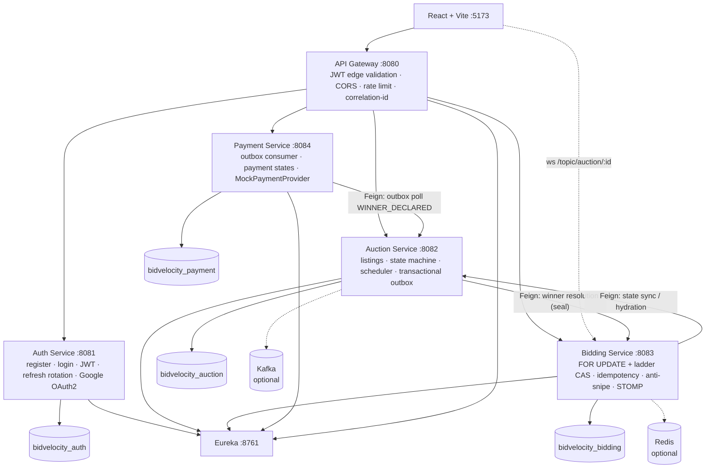
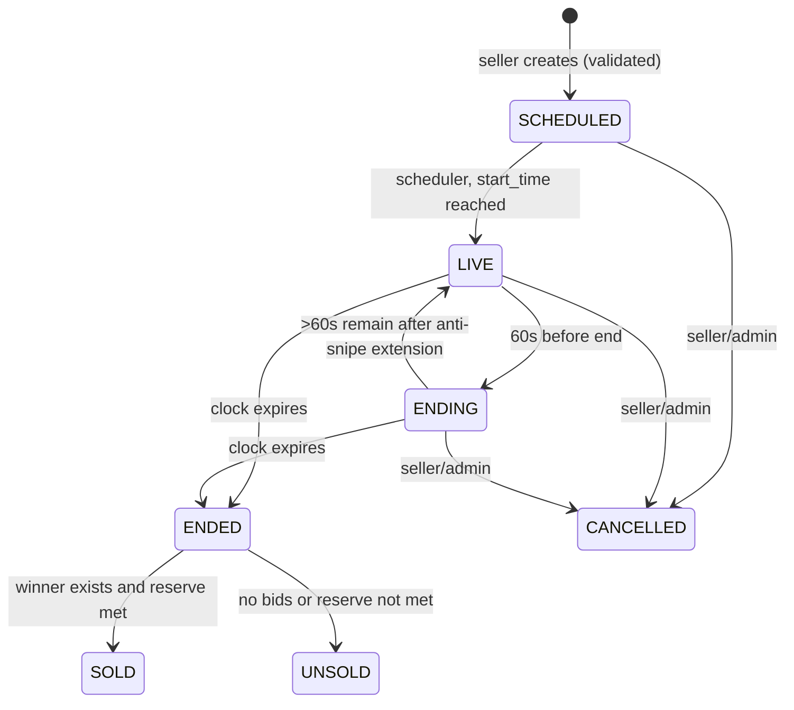
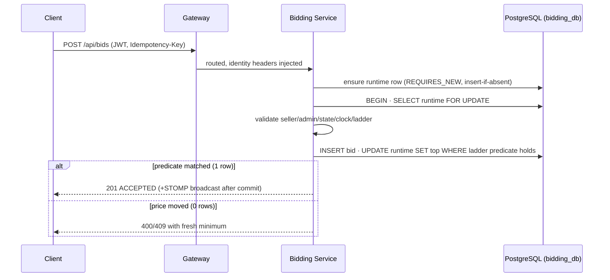

# BidVelocity — System Architecture

## Component topology (as built)

Dashed edges are optional or fallback paths: Redis accelerates throttling when
present (in-process fallback today); Kafka replaces outbox polling when provisioned
(same events, same handler). PostgreSQL is always the durable source of truth.

## Auction lifecycle

Invalid transitions return `409 INVALID_STATE_TRANSITION`. Closing is
re-entrant-safe: the auction asks the bidding ledger to **seal** (stop bids,
row-locked) and return the deterministic winner
(`amount DESC → accepted_at ASC → id ASC`); if the ledger reports the auction
is still open (anti-snipe extended), the auction heals its clock and retries
next tick. `WinnerDeclared` is written to the transactional **outbox in the same
commit** as the SOLD state change — payment settlement is asynchronous, never a
synchronous Bidding→Auction→Payment chain.

## Bid acceptance gate (concurrency)

Two layers make this race-free on any number of bidding instances: the row
lock serializes the critical section, and the ladder condition lives **inside
the UPDATE predicate**, so it is evaluated against the row's committed values
at lock-acquisition time — a stale Java-side read can never double-accept.
`Idempotency-Key` has a unique constraint; replays return the original outcome.

## Data ownership (database-per-service)

| Service | Owns | Never touches |
|---|---|---|
| auth | users, roles, user_roles, refresh_tokens | other services' tables |
| auction | auctions, auction_categories, outbox_events | bids, payments |
| bidding | bids, bid_runtime | auctions, payments |
| payment | payments, payment_transactions | bids, auctions |

Cross-service references are logical IDs only; no cross-database foreign keys;
all interaction is REST/Feign or outbox events.
